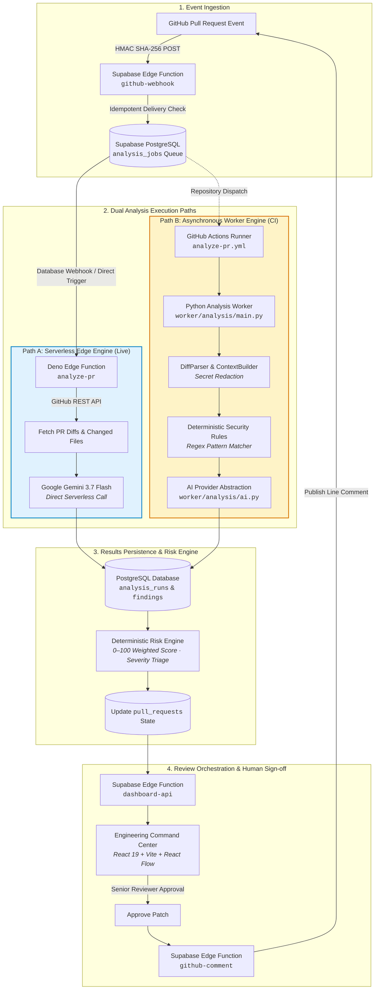
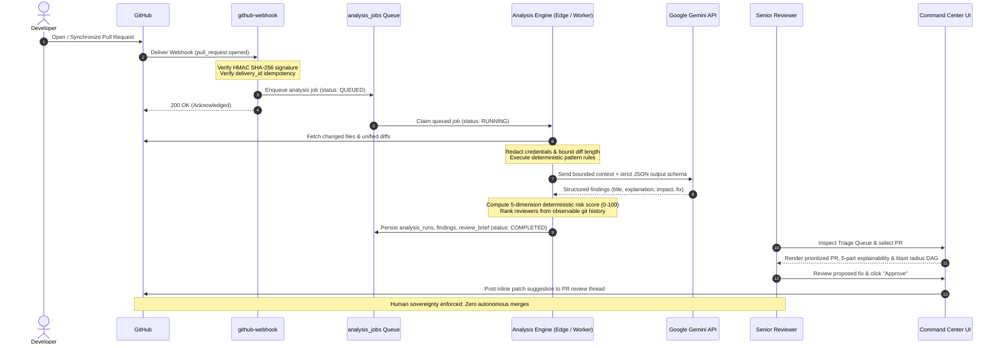
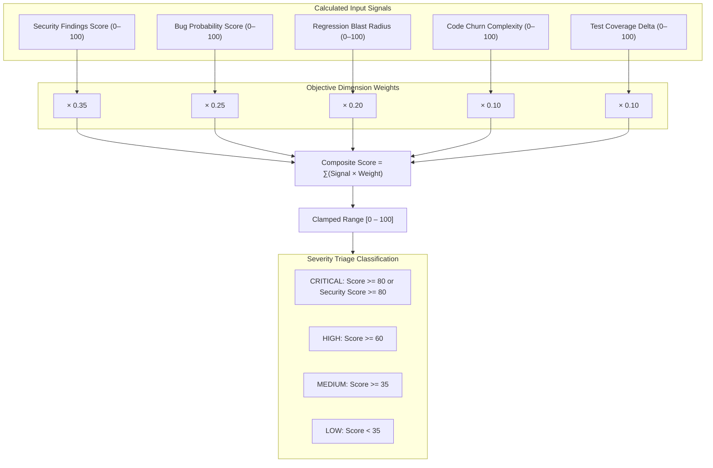

# PR Sentinel
### Pull Request Risk Intelligence & Review Orchestration

> **“Don’t review every PR. Review the PRs that matter.”**

> AI analyzes and proposes fixes, while senior engineers retain the final merge decision.

[](https://pr-sentinel-55j.pages.dev/)
[](LICENSE)
[](apps/dashboard)
[](supabase)
[](worker)
[](.github/workflows)

---

## 🖥️ Command Center Interface

PR Sentinel provides an editorial, data-dense **Engineering Command Center** built for engineering teams, tech leads, and security reviewers.

```text
┌──────────────────────────────────────────────────────────────────────────────────────────────────┐
│  PR SENTINEL // TRIAGE QUEUE                                      ACTIVE REPOS: 4  TOTAL PRS: 148 │
├──────────────────────────────────────────────────────────────────────────────────────────────────┤
│  [SEVERITY: ALL] [REPO: ALL REPOS] [SEARCH: auth...]                             [● LIVE FEED]   │
├──────────────────────────────────────────────────────────────────────────────────────────────────┤
│  PR #184  refactor(auth): migrate token rotation and session caching     [84 CRITICAL] [PRIORITY: 95]│
│           author: alexchen · base: main · head: feat/auth-cache · +412 -189 · 14 files           │
│           ⚠ Blast radius: Unbounded retry loop in token exchange if cache disconnects            │
│           → Surface: src/auth/jwt.ts, src/auth/session.ts                                        │
├──────────────────────────────────────────────────────────────────────────────────────────────────┤
│  PR #183  feat(billing): implement webhook idempotency key validation    [62 HIGH]     [PRIORITY: 72]│
│           author: sarah-m · base: main · head: feat/stripe-idempotency · +128 -34 · 5 files      │
│           ⚡ Blast radius: Potential database lock contention under burst delivery                │
├──────────────────────────────────────────────────────────────────────────────────────────────────┤
│  PR #182  chore(deps): update tree-sitter bindings                       [18 LOW]      [PRIORITY: 20]│
│           author: dependabot[bot] · base: main · head: deps/tree-sitter · +45 -42 · 2 files      │
│           ✓ Static match clean: zero security or regression vulnerabilities detected             │
└──────────────────────────────────────────────────────────────────────────────────────────────────┘
```

> **Live Production Dashboard:** [https://pr-sentinel-55j.pages.dev/](https://pr-sentinel-55j.pages.dev/)  
> *(The Command Center connects directly to live Supabase Edge telemetry and falls back gracefully to local demonstration state if disconnected).*

---

## 💡 The Four Core Differentiators

PR Sentinel is neither an AI chatbot nor a generic code-commenting bot that litters pull requests with stylistic nits. It is an **engineering triage and review orchestration instrument**:

```
                       TRADITIONAL AI BOTS                   PR SENTINEL
              ┌─────────────────────────────────────┐  ┌─────────────────────────────────────┐
  FOCUS       │  Every changed line equally         │  │  High-risk architectural surfaces   │
  NOISE       │  High: stylistic & formatting nits  │  │  Low: filtered by severity & impact │
  DECISIONS   │  Superficial inline LLM summaries   │  │  Deterministic 0-100 risk scoring   │
  ROUTING     │  None: standard round-robin         │  │  Ownership-based reviewer routing   │
  SOVEREIGNTY │  Unchecked auto-suggestions         │  │  Strict zero autonomous merges      │
              └─────────────────────────────────────┘  └─────────────────────────────────────┘
```

### 1. Risk-First Review
Focus senior engineering attention strictly on PRs that carry architectural risk, security vulnerabilities, or regression potential. Low-risk changes (documentation, small dependency updates, isolated tests) are deprioritized in the queue.

### 2. Deterministic + AI Hybrid Analysis
Combines fast, predictable deterministic security and complexity rules with context-bounded AI reasoning (Google Gemini). Deterministic checks establish ground-truth evidence; AI evaluates holistic system intent.

### 3. Evidence-Based Reviewer Routing
Matches changed files against historical git commit recency and ownership surface area to rank the most qualified reviewers in the repository, excluding the author.

### 4. Human Sovereignty by Design
AI proposes findings and isolated diff patches; humans retain the final decision. PR Sentinel enforces strict zero autonomous merges and zero unapproved production deployments.

---

## 🏗️ System Architecture

PR Sentinel is designed around an event-driven, serverless architecture that separates lightweight API handling from heavy repository analysis.

The repository supports **two distinct analysis execution paths** that share the same durable PostgreSQL queue and entity model:



### Architectural Execution Boundaries

* **Path A — Serverless Edge Engine (`supabase/functions/analyze-pr/index.ts`):** Directly executed within Supabase Deno Edge runtime for near-instant PR analysis. Fetches files via GitHub API, calls Google Gemini (`gemini-3.7-flash`) with structured JSON schemas, parses findings, and updates the database immediately.
* **Path B — Asynchronous Worker Engine (`worker/analysis/main.py`):** An ephemeral Python runner designed for heavy compute in GitHub Actions (`.github/workflows/analyze-pr.yml`). Executes unified diff parsing (`diff.py`), secret sanitization (`context.py`), static pattern matching (`security.py`), and AI provider dispatch (`ai.py`).
* **Durable Queue (`supabase/migrations/0001_initial.sql`):** PostgreSQL `analysis_jobs` table serves as the durable queue (`QUEUED -> RUNNING -> COMPLETED / FAILED`), with unique composite keys preventing duplicate runs for identical commit SHAs.

---

## ⚡ End-to-End Workflow



---

## 🔍 Five-Part Finding Explainability Standard

Every finding surfaced by PR Sentinel adheres to a strict 5-part engineering explainability contract, eliminating vague LLM feedback:

```text
┌──────────────────────────────────────────────────────────────────────────────────────────────────┐
│ [CRITICAL] SEC-SQL-01: Potential SQL Injection via Direct Interpolation                          │
├──────────────────────────────────────────────────────────────────────────────────────────────────┤
│ 1. WHAT     Unescaped user parameter injected directly into database query string.               │
│ 2. WHERE    src/billing/stripe.ts (Lines 42–46)                                                  │
│ 3. WHY      Detected raw string concatenation using `req.body.customerId` inside `client.query`. │
│ 4. IMPACT   Allows arbitrary SQL statement execution, credential leakage, or data tampering.    │
│ 5. EVIDENCE Pattern match SEC-SQL-01 on commit 71c04d2: `query = "SELECT * FROM ... " + id`      │
├──────────────────────────────────────────────────────────────────────────────────────────────────┤
│ PROPOSED FIX:                                                                                    │
│ - const query = "SELECT * FROM billing WHERE customer_id = " + req.body.customerId;             │
│ + const query = "SELECT * FROM billing WHERE customer_id = $1";                                  │
│ + const result = await client.query(query, [req.body.customerId]);                               │
│                                                                                                  │
│ [APPROVE & PUBLISH PATCH TO GITHUB]                                  [DISMISS FINDING]           │
└──────────────────────────────────────────────────────────────────────────────────────────────────┘
```

1. **What:** Precise technical classification of the vulnerability or regression.
2. **Where:** Exact relative file path and 1-indexed line boundaries (`line_start` to `line_end`).
3. **Why:** Underlying mechanical cause of the detection.
4. **Impact:** Architectural blast radius or runtime consequence if merged to production.
5. **Evidence:** Concrete snippet match, rule ID, or verifiable commit reference.

---

## 📊 Deterministic Risk Intelligence Engine

PR Sentinel removes subjectivity from pull request evaluation by calculating an objective, repeatable **0–100 risk score** across five weighted engineering dimensions:



### Risk Dimension Formula Reference (`worker/analysis/risk.py`)

| Dimension | Weight | Mathematical Formulation & Input Signals |
|---|:---:|---|
| **Security** | `35%` | Sum of security severities: Critical (`+50`), High (`+30`), Medium (`+15`), Low (`+5`). Clamped to `100`. |
| **Bug Probability** | `25%` | Sum of bug severities: Critical (`+45`), High (`+25`), Medium (`+10`), Low (`+5`). Clamped to `100`. |
| **Regression Blast Radius** | `20%` | Direct calculation: `min(100, (regression_findings * 30) + (changed_files * 4))`. |
| **Code Churn Complexity** | `10%` | Total churn (`additions + deletions`): `>800` lines (90), `>400` lines (65), `>150` lines (40), `<=150` lines (15). |
| **Test Coverage Delta** | `10%` | Evaluates presence of test changes: PR modifies test files (`10`), PR contains zero tests (`75`). |

**Triage Thresholds:**
* `CRITICAL`: Overall score $\ge 80$ OR Security dimension $\ge 80$.
* `HIGH`: Overall score $\ge 60$.
* `MEDIUM`: Overall score $\ge 35$.
* `LOW`: Overall score $< 35$.

---

## 🕸️ Code Risk Blast Radius Graph

Located on the PR Details page (`apps/dashboard/src/components/RiskSurfaceGraph.tsx`), PR Sentinel renders an interactive, directed acyclic graph (DAG) powered by `@xyflow/react` (React Flow v12).

The graph models dependencies and propagation paths across modified files:

```text
               ┌───────────────────────┐
               │  src/auth/session.ts  │ ──► [⚠ UNBOUNDED RETRY LOOP] ──► Thread Starvation
               └───────────────────────┘
              ▲
              │
  [PR #184] ──┤
              │
              ▼
               ┌───────────────────────┐
               │    src/auth/jwt.ts    │ ──► [⚡ WEAK TOKEN SECRET]   ──► Auth Bypass Risk
               └───────────────────────┘
```

* **Root Node:** Pull Request summary with composite risk score and severity badge.
* **Middle Tier:** Changed repository files color-coded by churn and finding severity.
* **Leaf Nodes:** Discrete security/regression finding nodes displaying the exact failure mode and downstream blast radius.

---

## 👥 Evidence-Based Reviewer Recommendation Engine

Implemented in `worker/analysis/reviewer.py`, this engine identifies optimal human reviewers using observable repository history rather than arbitrary assignment:

```text
Score = (Ownership Surface Area × 60.0) + (Commit Recency Volume × 40.0)
```

1. **Ownership Surface Area (60% Weight):** Measures what fraction of modified PR files the candidate has contributed to (`matched_files / total_changed_files`).
2. **Commit Recency & Volume (40% Weight):** Normalized frequency of historical commits in the affected directories (`min(1.0, commit_count / 20.0)`).
3. **Author Exclusion Rule:** The PR author is strictly excluded from candidate ranking.
4. **Transparent Evidence Rationale:** Outputs scannable justification bullets:
   * *“Touches 85% of PR surface area (6 of 7 modified files)”*
   * *“Contributed 24 commits across auth and middleware subsystems”*

---

## 🔧 Fix Generation & Validation Pipeline

PR Sentinel provides an orchestrated pathway for automated repair:

```
Finding Detected
       ↓
Diff Patch Proposed (Unified git patch generated via generate-fix)
       ↓
Ephemeral Validation Pipeline (Status: TESTING → VALIDATED / FAILED)
       ↓
Human Reviewer Sign-off (Tech lead clicks "Approve Patch")
       ↓
GitHub Line Comment Injected (Review comment published to PR thread)
```

### Current Status vs. Architectural Roadmap
* **Current MVP Implementation:**
  - Automated patch formulation and database tracking (`generated_fixes` table).
  - Validation lifecycle state machine (`GENERATED -> TESTING -> VALIDATED / FAILED`).
  - Validation runner (`worker/validation/validate_patch.py`) currently executes **simulated** unit test passes.
* **Roadmap Implementation:**
  - Isolated execution of patches inside ephemeral Docker containers.
  - Live execution of project unit test suites (`pytest`, `npm test`) and linters against the patched workspace before approval.

---

## 🚦 Feature Status Matrix

| Capability | Status | Implementation Details |
|---|:---:|---|
| **GitHub Webhook Ingestion** | ✅ Implemented | HMAC SHA-256 signature verification & delivery idempotency (`github-webhook`) |
| **Durable PostgreSQL Queue** | ✅ Implemented | 14 relational tables, queue state machine, indexes, and organization RLS |
| **Serverless PR Analysis** | ✅ Implemented | Deno Edge function calling Gemini 3.7 Flash with structured JSON schema (`analyze-pr`) |
| **Deterministic Security Rules** | ✅ Implemented | Regex rules: SQLi (`SEC-SQL-01`), Secrets (`SEC-SECRET-02`), Loops (`BUG-UNBOUND-03`), Auth (`REG-AUTH-04`) |
| **Secret Redaction & Bounding** | ✅ Implemented | Pre-inference credential sanitization & diff line bounding (`context.py`) |
| **Deterministic Risk Scoring** | ✅ Implemented | 5-dimension weighted algorithm (0–100) with severity thresholds (`risk.py`) |
| **Reviewer Recommendation** | ✅ Implemented | Ownership surface area + commit volume ranking from git history (`reviewer.py`) |
| **Engineering Command Center** | ✅ Implemented | React 19 + Tailwind v4 + React Flow v12 + Recharts SPA (`apps/dashboard`) |
| **Interactive Risk Blast Radius** | ✅ Implemented | React Flow DAG linking PR root to files and finding nodes (`RiskSurfaceGraph.tsx`) |
| **GitHub PR Review Publisher** | ✅ Implemented | Direct posting of formatted review reports & patch suggestions to GitHub comments |
| **Python Worker CI Workflow** | 🟡 Partial | Workflow (`analyze-pr.yml`) & sub-modules exist; full pipeline chaining in progress |
| **Dynamic Patch Generation** | 🟡 Partial | Patch proposal schema exists; emits template guard diffs in current MVP |
| **Fix Validation Pipeline** | 🟡 Partial (Simulated) | State machine & persistence functional; test runner execution simulated in MVP |
| **Tree-sitter AST Parsing** | 🔵 Roadmap | Architecture accommodates AST nodes; currently represented by regex rules |
| **Semgrep Rule Execution** | 🔵 Roadmap | Installed in CI dependencies; worker execution integration planned |
| **Docker-Sandboxed Validation** | 🔵 Roadmap | Isolated ephemeral container execution for patches and tests |
| **Local Ollama Provider** | 🔵 Roadmap | Provider abstraction supports interface; Python client class planned |
| **Enterprise BYOK AI Gateway** | 🔵 Roadmap | Proxy routing for corporate Azure OpenAI / AWS Bedrock gateways |

---

## 🧰 Technology Stack

Every technology listed below is verified in the active codebase:

| Subsystem | Technologies Verified | Role in Repository |
|---|---|---|
| **Frontend Framework** | React 19 (`19.2.8`), TypeScript (`~6.0.2`), Vite (`8.3.0`) | Client-side Command Center Single Page Application |
| **Styling & Theme** | Tailwind CSS v4 (`4.3.3`), Space Grotesk, JetBrains Mono | Constructivist drafting aesthetic, data-dense layouts |
| **Interactive Graphs** | `@xyflow/react` (`12.12.0` / React Flow v12) | Interactive DAG representing code risk blast radius |
| **Data Visualization** | Recharts (`3.10.1`), Lucide React (`1.49.0`) | Historical risk trends, telemetry charts, technical icons |
| **Client State & API** | `@tanstack/react-query` (`5.104.1`), `@supabase/supabase-js` (`2.117.2`) | Real-time querying, caching, REST integration |
| **Edge Serverless** | Supabase Edge Functions (Deno runtime, TypeScript) | Webhook ingestion, REST API, orchestration, AI proxy |
| **Database & Queue** | PostgreSQL (Supabase), Row-Level Security (RLS), `pgcrypto` | Durable queue (`analysis_jobs`), audit trails, multi-tenant data |
| **Asynchronous Worker** | Python 3.11+, PyJWT, Requests, Pydantic | Heavy diff parsing, secret masking, risk & reviewer scoring |
| **AI Inference** | Google Gemini API (`gemini-3.7-flash` / `gemini-flash-latest`) | Context-aware finding extraction, review briefs, fix ideas |
| **CI/CD & Ephemeral Compute** | GitHub Actions (`actions/checkout@v4`, `actions/setup-python@v5`) | Ephemeral execution runners for analysis and validation |
| **Static Code Checks** | Python `re` pattern matching engine | Fast deterministic baseline finding generation |
| **Deployment Targets** | Cloudflare Pages (Frontend), Supabase (Backend), GitHub Actions (Compute) | Operational development deployment model |

---

## 📂 Repository Structure

```text
PR-Sentinel/
├── .github/workflows/          # GitHub Actions orchestration
│   ├── analyze-pr.yml          # Ephemeral PR analysis worker workflow
│   └── validate-fix.yml        # Ephemeral fix validation worker workflow
├── apps/dashboard/             # Engineering Command Center (React 19 + Vite + Tailwind v4)
│   ├── src/
│   │   ├── components/         # RiskSurfaceGraph (React Flow), Header, ScrollToTop
│   │   ├── lib/                # API client (api.ts), Supabase client, utilities
│   │   ├── pages/              # QueuePage, PRDetailsPage, OpsOverviewPage, AboutPage
│   │   ├── types/              # Domain entity and API TypeScript definitions
│   │   ├── App.tsx             # Route declarations & root layout
│   │   └── index.css           # Architectural drafting grid tokens & typography
│   ├── package.json            # React 19, @xyflow/react, Recharts dependencies
│   └── vite.config.ts          # Vite build config with Tailwind v4 plugin
├── docs/                       # Formal engineering specifications
│   ├── PR_Sentinel_PRD.md      # Product Requirements Document (PRD v1.0)
│   ├── PR_Sentinel_TRD.md      # Technical Requirements Document (TRD v1.0)
│   ├── architecture.md         # System architecture specification
│   ├── design.md               # Design system & visual specifications
│   ├── rules.md                # Engineering guardrails & human sovereignty rules
│   ├── memory.md               # Architectural memory & context
│   └── tasks.md                # Implementation backlog
├── scripts/                    # Live demonstration & migration verification scripts
│   ├── seed_pr1_live.py        # Database seed script for PR #1 demo
│   └── verify_migrations.py    # SQL schema & RLS policy verification script
├── supabase/
│   ├── functions/              # 6 Deno Edge Functions
│   │   ├── analyze-pr/         # Serverless Gemini PR analysis function
│   │   ├── dashboard-api/      # REST API (stats, prs, pr details, approve patch)
│   │   ├── generate-fix/       # Diff patch proposition generator
│   │   ├── github-comment/     # PR review report publisher to GitHub comments
│   │   ├── github-install/     # GitHub App installation webhook handler
│   │   └── github-webhook/     # HMAC SHA-256 verification & queue ingestion
│   └── migrations/             # 3 PostgreSQL migrations
│       ├── 0001_initial.sql    # 14 relational tables & queue definitions
│       ├── 0002_indexes.sql    # 9 performance & queue retrieval indexes
│       └── 0003_rls.sql        # Row-Level Security policies for multi-tenancy
├── tests/                      # Python unit test suites
│   ├── test_github.py          # HMAC & GitHub App JWT authentication tests
│   ├── test_pipeline.py        # Diff, secret mask, risk, reviewer engine tests
│   └── test_worker.py          # Worker lifecycle & state transition tests
├── worker/                     # Asynchronous analysis & validation engine (Python)
│   ├── analysis/
│   │   ├── ai.py               # AI provider abstraction (Gemini + Mock)
│   │   ├── context.py          # Bounded context builder & secret masking
│   │   ├── diff.py             # Unified diff parser & line extractor
│   │   ├── github.py           # GitHub App JWT & PR metadata extractor
│   │   ├── main.py             # Analysis worker entrypoint & job polling
│   │   ├── reviewer.py         # Reviewer recommendation engine
│   │   ├── risk.py             # Deterministic multi-dimensional risk engine
│   │   └── security.py         # Deterministic static security rule engine
│   └── validation/
│       └── validate_patch.py   # Ephemeral fix validation runner
├── .env.example                # Canonical environment variable reference
├── PRODUCT.md                  # Product positioning & schema specification
└── README.md                   # Project documentation
```

---

## 🚀 Quick Start & Local Setup

### 1. Prerequisites
* **Node.js:** `18+` & `npm`
* **Python:** `3.11+`
* **Supabase:** Hosted project URL & Service Role key (or local Supabase CLI)

### 2. Frontend Command Center Setup
```bash
# Navigate to dashboard
cd apps/dashboard

# Install dependencies
npm install

# Start development server
npm run dev
# Command Center runs locally at http://localhost:5173
```

### 3. Database Migrations Setup
Apply SQL migrations sequentially in your Supabase SQL Editor:
1. `supabase/migrations/0001_initial.sql` (14 tables, constraints, UUID extensions)
2. `supabase/migrations/0002_indexes.sql` (9 queue & lookup performance indexes)
3. `supabase/migrations/0003_rls.sql` (Multi-tenant Row Level Security policies)

Verify migration integrity:
```bash
python scripts/verify_migrations.py
```

### 4. Running the Python Test Suite
```bash
# Install test dependencies
pip install requests pyjwt supabase pydantic pytest

# Run all test suites
python -m pytest tests/
```

### 5. Running the Python Analysis Worker Manually
```bash
# Export Supabase & AI environment variables
export SUPABASE_URL="https://your-project.supabase.co"
export SUPABASE_SERVICE_ROLE_KEY="your-service-role-key"
export GEMINI_API_KEY="your-gemini-key"

# Process a specific queued job
JOB_ID="your-job-uuid" python worker/analysis/main.py
```

---

## ⚙️ Environment Configuration

Refer to [`.env.example`](.env.example) for the complete canonical environment specification:

| Variable | Scope | Description |
|---|---|---|
| `VITE_SUPABASE_URL` | Frontend | Supabase project endpoint URL |
| `VITE_SUPABASE_ANON_KEY` | Frontend | Public anonymous Supabase API key |
| `VITE_API_BASE_URL` | Frontend | Endpoint pointing to `/functions/v1` |
| `SUPABASE_SERVICE_ROLE_KEY` | Backend/Worker | Privileged service key (never exposed to browser) |
| `GITHUB_APP_ID` | Backend/Worker | Numeric GitHub App ID |
| `GITHUB_WEBHOOK_SECRET` | Backend | Secret string for HMAC SHA-256 signature verification |
| `GITHUB_PRIVATE_KEY` | Worker | RSA private key PEM for generating installation tokens |
| `GEMINI_API_KEY` | Backend/Worker | Google Gemini API key for structured inference |
| `AI_PROVIDER` | Worker | Configured provider: `gemini` or `mock` |

---

## 🔒 Security, Privacy & Data Protection

* **HMAC SHA-256 Webhook Verification:** All incoming events from GitHub are authenticated cryptographically in `supabase/functions/github-webhook/index.ts` before processing.
* **Delivery Idempotency:** The `webhook_events` table enforces a unique constraint on `delivery_id`, safely ignoring replayed webhooks.
* **Secret Redaction Prior to LLM Inference:** `ContextBuilder.sanitize_secrets()` in `worker/analysis/context.py` strips known credential patterns (`ghp_*`, `sk-*`, `AIza*`, bearer tokens) before prompt assembly.
* **Bounded Data Transfers:** Diffs are truncated to a maximum of 200 lines per file and 100k total characters to prevent denial-of-service and context overflow.
* **Row-Level Security (RLS):** All 14 tables in PostgreSQL enforce RLS policies restricting data visibility to authenticated organization members via `auth_user_org_id()`.
* **Stateless Source Code Policy:** PR Sentinel does not clone or store repositories permanently; analysis operates on ephemeral diff payloads.

---

## 🧭 Planned Local Inference & Extensibility (Roadmap)

PR Sentinel is designed to accommodate private and airgapped environments as the project evolves:

* **Local Ollama Integration:** The `AIProvider` base class in `worker/analysis/ai.py` defines the contract for an upcoming `OllamaAIProvider` targeting local models (`llama3.2`, `codellama`, `deepseek-coder`).
* **Deep AST Parsing via Tree-sitter:** Upgrading regex rules to syntax tree analysis for multi-language AST inspection.
* **Native Semgrep Rule Enforcement:** Embedding Semgrep rules directly into the ephemeral CI worker for advanced taint analysis.
* **Isolated Container Sandboxes:** Packaging patch validation into ephemeral Docker containers with real test runner execution.
* **Enterprise BYOK AI Gateways:** Support for proxying requests through corporate Azure OpenAI, AWS Bedrock, or internal LLM endpoints.

---

## 📜 Documentation & Specifications

* [Product Requirements Document (PRD)](docs/PR_Sentinel_PRD.md)
* [Technical Requirements Document (TRD)](docs/PR_Sentinel_TRD.md)
* [System Architecture Specification](docs/architecture.md)
* [Visual Design System & UX Spec](docs/design.md)
* [Engineering Rules & Guardrails](docs/rules.md)
* [Project Memory & Context](docs/memory.md)
* [Implementation Backlog](docs/tasks.md)

---

## ⚖️ Architectural Principles & Human Sovereignty

1. **Human Sovereignty is Mandatory:** AI is an engineering assistant, never an autonomous production decision maker. PR Sentinel will never automatically merge pull requests or deploy code to production without human sign-off.
2. **Evidence Over Hallucination:** Every warning and recommendation must link directly to observable repository artifacts, line numbers, and static rule matches.
3. **Signal Over Noise:** Prioritize critical vulnerabilities; never drown engineering teams in superficial stylistic comments.
4. **Observable History Only:** Reviewer matching evaluates verifiable git commit recency and ownership surface area. It does not infer personal or performance metrics.

---

## 📄 License

PR Sentinel is open-source software licensed under the [MIT License](LICENSE).
