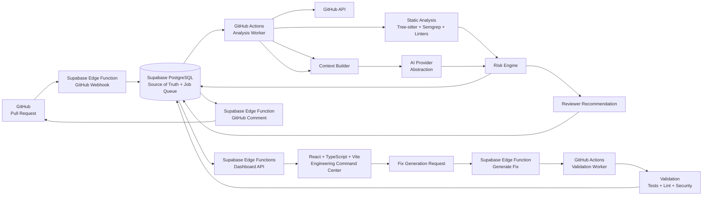
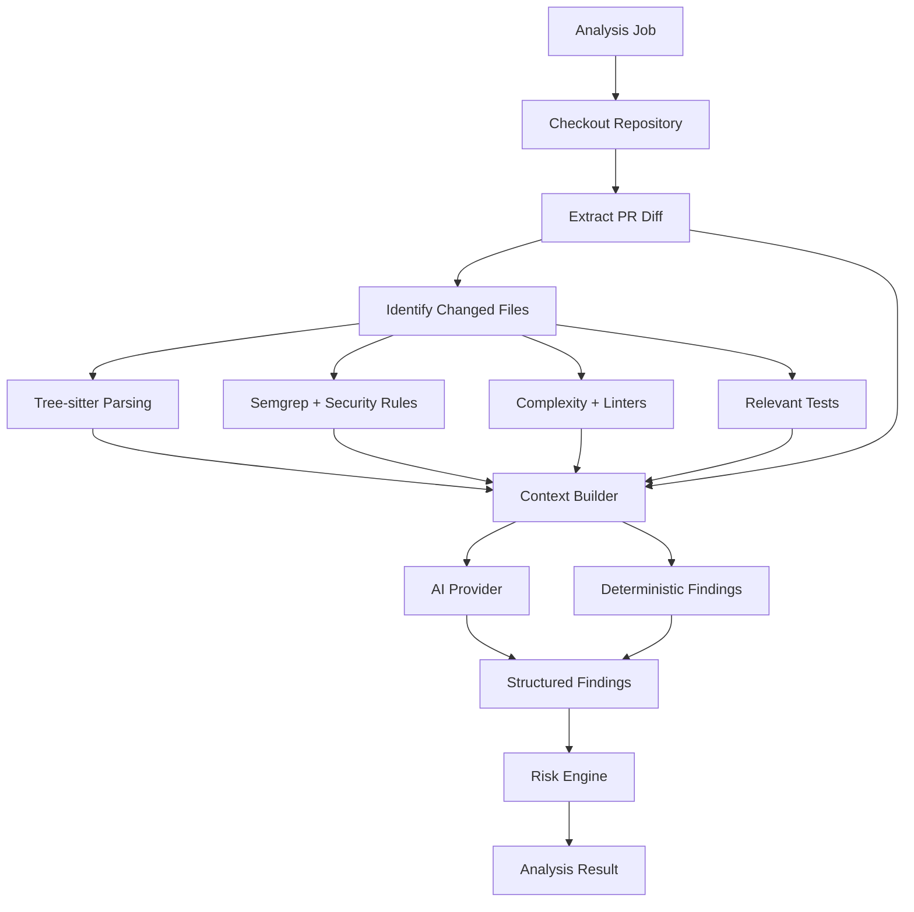
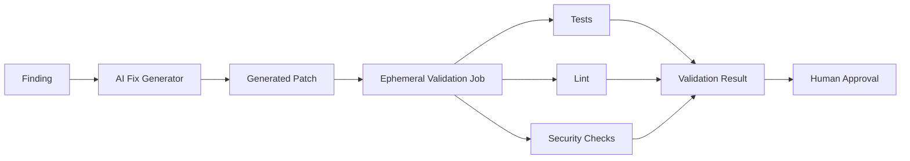
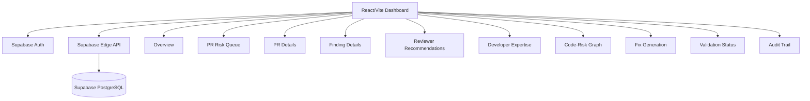
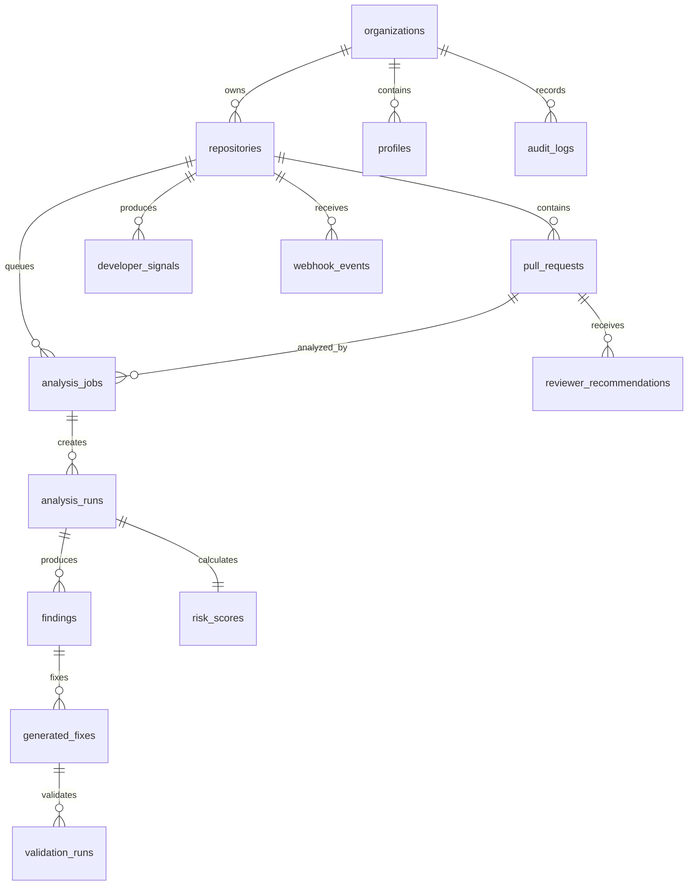
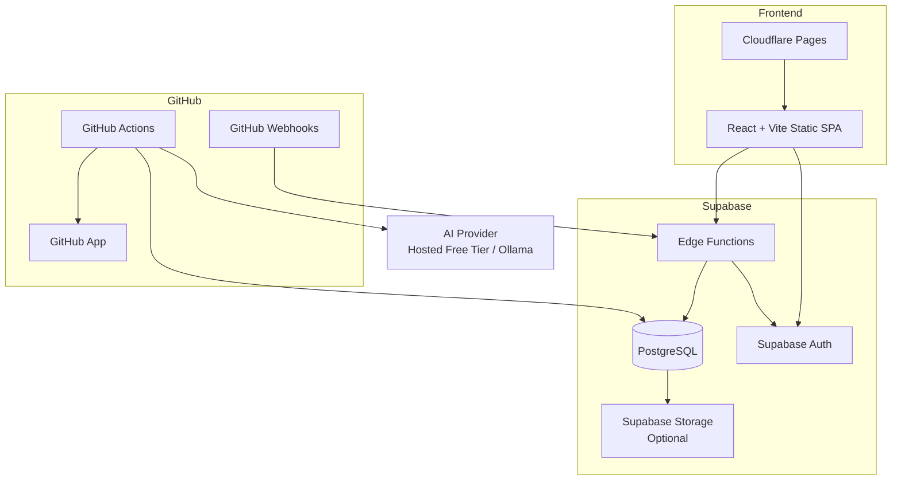
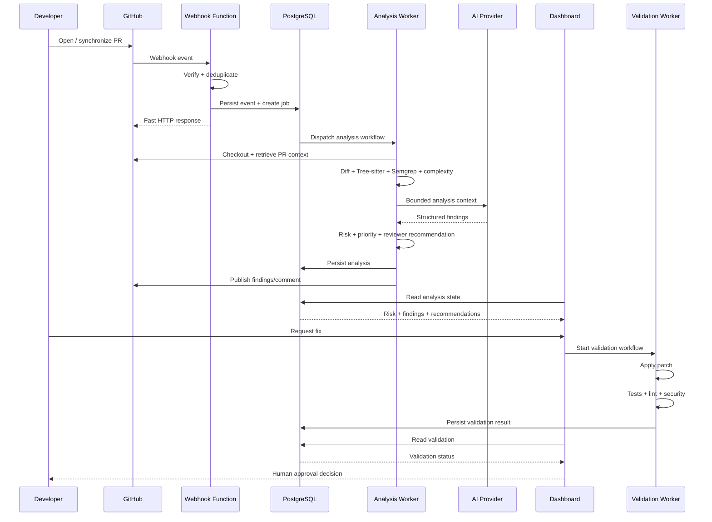

# PR Sentinel — System Architecture

> **AI Engineering Risk & Review Orchestration Platform**  
> Version: 1.0 — Hackathon MVP  
> Architecture style: Event-driven + Serverless  
> Deployment goal: Zero-budget/free-tier MVP

## 1. Overview

PR Sentinel is an AI-assisted engineering risk and review orchestration platform for GitHub Pull Requests.

The platform consumes GitHub Pull Request activity, performs deterministic and AI-assisted analysis, identifies engineering risks, calculates a deterministic risk score, prioritizes review work, recommends reviewers using repository evidence, generates review briefs and potential fixes, and validates generated fixes before human approval.

The core workflow is:

**Detect → Explain → Score → Prioritize → Assign → Fix → Validate → Human Approval**

The system deliberately keeps HTTP-facing services lightweight and moves expensive repository analysis and validation into ephemeral GitHub Actions workers.

---

## 2. Architectural Goals

The MVP architecture is designed to:

- Receive GitHub Pull Request events reliably.
- Store repository, installation, PR, analysis, finding, risk, review, fix, and validation state.
- Extract diffs and relevant source context.
- Perform deterministic static analysis.
- Perform bounded AI-assisted analysis.
- Produce structured and explainable findings.
- Calculate deterministic PR risk.
- Prioritize Pull Requests.
- Generate evidence-based reviewer recommendations.
- Generate concise AI review briefs.
- Generate potential fixes for supported findings.
- Validate generated fixes in an isolated environment.
- Publish important findings back to GitHub.
- Provide an Engineering Command Center.
- Maintain an audit trail.
- Operate without a permanently running worker server or Redis.

---

## 3. High-Level Architecture



### Core architectural boundary

| Boundary | Responsibility |
|---|---|
| GitHub | Source control, Pull Requests, repository events, comments and repository metadata |
| Supabase Edge Functions | Lightweight HTTP/webhook/API handling |
| Supabase PostgreSQL | Durable application state, analysis queue, idempotency and audit data |
| GitHub Actions | Ephemeral heavy compute for analysis and validation |
| Static Analysis Layer | Syntax, security, complexity and deterministic code intelligence |
| AI Provider Layer | Context-aware AI findings, review briefs and fix generation |
| React Dashboard | Human-facing engineering command center |
| Validation Worker | Isolated execution of generated patches |

---

## 4. Architectural Principles

### 4.1 Event-driven

GitHub events initiate asynchronous processing.

The webhook handler does **not** perform repository analysis. It validates and persists the event, creates an analysis job, dispatches the worker, and returns quickly.

### 4.2 PostgreSQL as the durable queue

The MVP does not introduce Redis or another managed queue.

`analysis_jobs` acts as the durable queue and state store:

```text
QUEUED
  |
  v
RUNNING
  |
  +------> COMPLETED
  |
  +------> FAILED
  |
  +------> CANCELLED
```

A uniqueness constraint prevents duplicate work for the same repository, Pull Request, commit SHA and analysis version.

### 4.3 Ephemeral compute

Heavy work runs in GitHub Actions:

- repository checkout
- diff extraction
- syntax parsing
- Semgrep
- native linters
- complexity analysis
- bounded context construction
- AI analysis
- tests
- Docker-based validation

This avoids an always-on backend worker.

### 4.4 Human-in-the-loop

AI recommendations and generated patches are advisory.

The MVP does not:

- automatically merge Pull Requests
- automatically deploy fixes
- replace human approval
- guarantee bug-free code
- make employment or performance judgments

### 4.5 Provider abstraction

The AI layer is isolated behind an `AIProvider` interface so hosted models and local inference can be swapped without changing the analysis pipeline.

### 4.6 Bounded AI context

The complete repository must not be blindly sent to the LLM.

The context builder prioritizes:

1. Changed lines
2. Surrounding function/method
3. Calling functions
4. Imported modules
5. Relevant tests
6. Relevant configuration
7. Relevant historical changes

Hard limits apply to file count, bytes and estimated token count.

---

## 5. Component Architecture

### 5.1 GitHub Integration

PR Sentinel uses a **GitHub App**, not a Personal Access Token.

Required MVP permissions are scoped to the documented needs:

| Permission | Access | Purpose |
|---|---|---|
| Contents | Read | Repository files and commits |
| Pull Requests | Read/Write | Read PRs and publish findings |
| Metadata | Read | Repository metadata |
| Issues | Read/Write | PR comments where required |
| Checks | Read | Existing CI/check information |
| Commit statuses | Read | Existing validation state |

Supported events:

- `pull_request.opened`
- `pull_request.synchronize`
- `pull_request.reopened`
- `pull_request.closed`
- `pull_request_review.submitted`
- `push`

### 5.2 Webhook Receiver

The webhook Edge Function performs:

```text
Receive Request
    ↓
Verify GitHub Signature
    ↓
Parse Event Type
    ↓
Reject Unsupported Event
    ↓
Check Delivery ID
    ↓
Persist Webhook Event
    ↓
Create Analysis Job
    ↓
Dispatch Analysis Workflow
    ↓
Return HTTP Response
```

Webhook processing must never wait for the complete analysis pipeline.

---

## 6. Analysis Worker Architecture



### Analysis stages

1. **Repository checkout**
2. **Diff extraction**
3. **Change extraction**
4. **Syntax-aware parsing**
5. **Deterministic security analysis**
6. **Complexity analysis**
7. **Relevant test identification**
8. **Context construction**
9. **AI analysis**
10. **Finding validation**
11. **Risk calculation**
12. **Review prioritization**
13. **Reviewer recommendation**
14. **Persistence**
15. **GitHub comment publication**

### Change extraction

The worker calculates:

- lines added
- lines removed
- changed files
- changed functions
- changed classes
- changed dependencies
- configuration changes
- database changes
- API changes
- test changes

---

## 7. Static Code Intelligence

### Tree-sitter

Tree-sitter provides syntax-aware parsing.

Initial language support:

- Python
- JavaScript
- TypeScript
- Java
- C++
- Go

Extracted structures include:

- functions
- classes
- methods
- imports
- calls
- variables
- control-flow structures

### Semgrep

Semgrep provides deterministic security checks for categories such as:

- SQL injection
- command injection
- cross-site scripting
- hardcoded secrets
- authentication bypass patterns
- authorization weaknesses
- unsafe deserialization
- insecure file operations
- sensitive data exposure

### Complexity signals

The system calculates or derives:

- cyclomatic complexity
- function length
- nesting depth
- dependency count
- change size
- duplicate-code signals where practical

---

## 8. Context Construction

The context builder prevents unnecessary repository-wide AI input.

```text
AnalysisContext
├── PR Diff
├── Changed Function
├── Containing File
├── Calling Functions
├── Imported Modules
├── Relevant Tests
├── Relevant Configuration
└── Historical Signals
```

Conceptually:

```text
Context =
    Diff
  + ChangedFunction
  + ContainingFile
  + Dependencies
  + RelevantTests
  + HistoricalSignals
```

The worker must enforce hard limits for:

- number of files
- bytes of source context
- estimated AI tokens

This reduces token consumption, latency, hallucination exposure and irrelevant findings.

---

## 9. AI Analysis Architecture

### Provider interface

The worker uses a provider abstraction conceptually equivalent to:

```python
class AIProvider:
    def analyze(context: AnalysisContext) -> list[AIFinding]:
        ...

    def generate_fix(
        finding: AIFinding,
        context: AnalysisContext
    ) -> GeneratedPatch:
        ...

    def generate_brief(
        context: ReviewContext
    ) -> ReviewBrief:
        ...
```

### Provider modes

| Mode | Purpose |
|---|---|
| Hosted free-tier model | Hackathon demonstration |
| Local Ollama | Development/private fallback |
| Future provider | Production migration or additional model support |

The application must not assume that the hosted provider is unlimited.

### Structured AI output

AI responses are machine-readable JSON and must be schema-validated before persistence.

```json
{
  "severity": "critical",
  "category": "security",
  "title": "Potential SQL Injection",
  "file": "auth/service.py",
  "line": 84,
  "description": "...",
  "impact": "...",
  "evidence": "...",
  "suggested_fix": "...",
  "confidence": 0.94
}
```

---

## 10. Finding Model

Every finding should explain:

- **What?** — issue identified
- **Where?** — file and line
- **Why?** — reasoning/evidence
- **Impact?** — engineering consequence
- **Evidence?** — relevant code/data flow

Findings contain:

| Field | Description |
|---|---|
| severity | Finding severity |
| category | Security, bug, regression, complexity or test risk |
| title | Short finding title |
| file_path | Affected file |
| line_start / line_end | Location |
| description | Explanation |
| impact | Potential impact |
| evidence | Supporting evidence |
| suggested_fix | Potential remediation |
| confidence | AI confidence where applicable |
| source | Deterministic or AI-generated |
| created_at | Creation timestamp |

---

## 11. Risk Engine

The Risk Engine converts analysis signals into a deterministic score.

Risk dimensions include:

- Security Impact
- Business Impact
- Regression Risk
- Complexity
- Change Size
- Dependency Impact
- Historical Risk

The TRD defines the normalized score as:

```text
RiskScore =
    0.30S
  + 0.20B
  + 0.15R
  + 0.10C
  + 0.10D
  + 0.10H
  + 0.05Z
```

where each dimension is normalized to `[0, 100]`.

The weights must be configurable and versioned.

**AI confidence must not directly override deterministic risk.**

Risk levels:

| Score | Level |
|---:|---|
| 0–24 | Low |
| 25–49 | Medium |
| 50–74 | High |
| 75–100 | Critical |

---

## 12. Review Orchestration

Review priority combines risk and workflow context.

Relevant signals include:

- risk score
- business impact
- waiting time
- change criticality
- security severity

Conceptually:

```text
Priority = f(
    Risk,
    BusinessImpact,
    WaitingTime,
    Criticality
)
```

The implementation remains configurable.

### Reviewer recommendation

Reviewer recommendations are evidence-based and use repository activity rather than unrelated personal attributes.

Signals include:

- files previously modified
- PRs previously reviewed
- module ownership
- technology expertise
- recent activity
- current review workload
- historical review experience

The TRD defines:

```text
ReviewerScore =
    0.40 FileExpertise
  + 0.25 RecentActivity
  + 0.20 ReviewHistory
  + 0.15 ModuleAffinity
```

Recommendations are overridable by the reviewer or engineering lead.

---

## 13. Fix Generation and Validation



Fix generation produces:

- explanation of proposed change
- unified diff or patch
- expected behavior
- potential side effects

Generated patches are never merged automatically.

### Validation states

```text
GENERATED
    ↓
APPLIED
    ↓
TESTING
    ↓
VALIDATED
```

Failure paths:

```text
TESTING → FAILED
GENERATED → REJECTED
```

### Sandbox requirements

Validation is performed in an ephemeral environment.

Recommended Docker restrictions include:

```text
--rm
--network none
--read-only
--cap-drop ALL
--security-opt no-new-privileges
--memory 1g
--cpus 1
```

The exact sandbox configuration is adapted to the language under test.

---

## 14. Dashboard Architecture

The frontend is a static React + TypeScript + Vite application.



Dashboard requirements include:

- Overview dashboard
- Pull Request risk queue
- Pull Request detail page
- Finding detail panel
- Reviewer recommendations
- Developer expertise view
- Fix generation view
- Validation status
- Audit trail
- Repository/code-risk graph

### Visualization

- **Recharts** — risk and analytics charts
- **React Flow** — repository/code-risk graph

Graph nodes may represent:

- Pull Requests
- files
- functions
- classes
- dependencies
- APIs
- tests
- external systems

Nodes may expose:

- risk score
- findings
- dependencies
- historical changes

---

## 15. Data Architecture

Supabase PostgreSQL is the durable source of truth.

### Core tables

```text
profiles
organizations
repositories
github_installations
pull_requests
webhook_events
analysis_jobs
analysis_runs
findings
risk_scores
developer_signals
reviewer_recommendations
generated_fixes
validation_runs
audit_logs
```

### Relationship overview



### Analysis job state

```text
QUEUED → RUNNING → COMPLETED
              └──→ FAILED
              └──→ CANCELLED
```

### Idempotency

`webhook_events` stores GitHub delivery identifiers with a unique constraint.

Duplicate webhook deliveries:

- return successfully
- do not create duplicate analysis jobs

Analysis results may be reused when:

```text
Repository + PR + CommitSHA + AnalysisVersion
```

remain unchanged.

---

## 16. API Architecture

Supabase Edge Functions provide the lightweight API boundary.

### Logical endpoints

| Endpoint | Method | Purpose |
|---|---|---|
| `/github/webhook` | POST | Receive GitHub events |
| `/github/install` | POST | Register installation metadata |
| `/analysis/callback` | POST | Receive worker completion |
| `/analysis/:id` | GET | Retrieve analysis result |
| `/prs` | GET | List Pull Requests |
| `/prs/:id` | GET | Retrieve PR details |
| `/findings/:id` | GET | Retrieve finding details |
| `/reviewers/:pr` | GET | Retrieve recommendations |
| `/fixes` | POST | Request fix generation |
| `/validation/:id` | GET | Retrieve validation status |

Sensitive endpoints require authentication or an internal callback secret.

---

## 17. Authentication and Authorization

Supabase Auth provides dashboard authentication.

Supported roles:

- Developer
- Reviewer
- Tech Lead
- Engineering Manager
- Organization Admin

Authorization uses:

- Supabase Row Level Security
- server-side role checks
- repository membership checks
- GitHub installation ownership checks

The Supabase service-role key must never be exposed to browser JavaScript.

---

## 18. Security Architecture

### Application security

The system implements:

- GitHub App authentication
- least-privilege repository permissions
- webhook signature verification
- secure server-side credential storage
- Supabase Row Level Security
- input validation
- rate limiting where practical
- audit logging
- idempotent event handling

### Secret management

Secrets must never be:

- committed to source code
- sent to the frontend
- unnecessarily included in AI prompts
- printed in logs
- persisted as plaintext unless technically unavoidable

Required secret classes include:

```text
SUPABASE_SERVICE_ROLE_KEY
GITHUB_APP_ID
GITHUB_APP_PRIVATE_KEY
GITHUB_WEBHOOK_SECRET
AI_PROVIDER_KEY
ANALYSIS_CALLBACK_SECRET
```

Frontend-visible configuration is limited to values intended for public client use, such as:

```text
VITE_SUPABASE_URL
VITE_SUPABASE_ANON_KEY
```

### AI security

Repository content is untrusted input.

The system must keep:

```text
RepositoryData != SystemInstructions
```

AI processing must account for:

- prompt injection
- malicious README instructions
- malicious comments
- data exfiltration attempts
- secret exposure
- malicious generated patches

The AI provider must not receive unrestricted tool access.

---

## 19. Threat Model

| Threat | Potential impact | Primary mitigation |
|---|---|---|
| Webhook spoofing | Fake analysis jobs | Signature verification |
| Credential leakage | Repository compromise | Server-side secret storage |
| Prompt injection | Incorrect AI behavior | Explicit data/instruction separation |
| Malicious patch | Code execution | Isolated validation |
| Duplicate webhook | Duplicate analysis | Delivery-ID idempotency |
| Unauthorized dashboard access | Data exposure | Auth + RLS |
| AI outage | Missing AI findings | Deterministic fallback |
| Repository exfiltration | Source leakage | Bounded context |

Protected assets include:

- GitHub credentials
- repository source code
- user identity information
- analysis results
- AI credentials
- generated patches

---

## 20. Caching and Performance

### Browser caching

The dashboard uses TanStack Query for client-side caching.

### Analysis caching

Identical analysis results can be reused when repository, PR, commit SHA and analysis version are unchanged.

### Quota-aware execution

The architecture should:

- avoid high-frequency polling
- paginate dashboard queries
- store only necessary analysis artifacts
- avoid excessive Edge Function invocations
- index common database queries
- archive/delete disposable artifacts
- bound AI prompts
- retry only transient errors
- stop retries after a bounded number of attempts
- fall back to deterministic analysis when AI is unavailable

### Prototype targets

| PR size | Target execution model |
|---|---|
| Small | `< 30s`, static analysis + bounded AI context |
| Medium | `< 90s`, asynchronous worker |
| Large | `< 3 min`, asynchronous worker + bounded context |

Webhook processing is always decoupled from full analysis execution.

---

## 21. Failure Handling

The system handles:

- GitHub API failure
- duplicate webhook delivery
- AI provider timeout
- AI rate limiting
- worker failure
- database failure
- invalid AI JSON
- invalid generated patch
- test failure
- security scan failure

### Failure principles

1. AI failure must not invalidate the underlying Pull Request.
2. Deterministic analysis should remain useful when AI is unavailable.
3. Failed jobs must retain their error state.
4. Retry behavior must be bounded.
5. Dashboard users should see actionable failure information.
6. Sensitive source code and secrets must not be included in logs.

Example dashboard state:

```text
Analysis unavailable

Reason:
AI provider timeout

Action:
Retry analysis
```

---

## 22. Observability

Every analysis receives a unique:

```text
analysis_run_id
```

Important events:

- webhook received
- analysis job created
- analysis started
- analysis completed
- AI request duration
- finding count
- risk calculation
- fix generation
- validation result
- API errors

Sensitive source code and secrets must not be written to application logs.

---

## 23. Repository Structure

The TRD defines the following baseline repository organization:

```text
pr-sentinel/
├── apps/
│   └── dashboard/
│       ├── src/
│       │   ├── components/
│       │   ├── pages/
│       │   ├── hooks/
│       │   ├── lib/
│       │   └── types/
│       ├── public/
│       └── package.json
│
├── supabase/
│   ├── functions/
│   │   ├── github-webhook/
│   │   ├── github-install/
│   │   ├── dashboard-api/
│   │   ├── analysis-callback/
│   │   ├── generate-fix/
│   │   ├── github-comment/
│   │   └── reviewer-recommendation/
│   │
│   └── migrations/
│       ├── 0001_initial.sql
│       ├── 0002_indexes.sql
│       └── 0003_rls.sql
│
├── worker/
│   ├── analysis/
│   │   ├── github.py
│   │   ├── diff.py
│   │   ├── parser.py
│   │   ├── security.py
│   │   ├── complexity.py
│   │   ├── context.py
│   │   ├── ai.py
│   │   ├── risk.py
│   │   ├── expertise.py
│   │   └── reviewer.py
│   │
│   └── validation/
│       ├── validate_patch.py
│       └── Dockerfile
│
├── .github/
│   └── workflows/
│       ├── analyze-pr.yml
│       └── validate-fix.yml
│
├── docs/
│   ├── architecture/
│   ├── api/
│   └── security/
│
├── package.json
└── README.md
```

---

## 24. Deployment Architecture



### Hosting model

| Component | Deployment |
|---|---|
| Frontend | Cloudflare Pages |
| API | Supabase Edge Functions |
| Database | Supabase PostgreSQL |
| Authentication | Supabase Auth |
| Optional artifact storage | Supabase Storage |
| Analysis compute | GitHub Actions |
| Validation compute | GitHub Actions + Docker |
| AI | Provider abstraction; hosted free-tier model or local Ollama |

The architecture intentionally excludes:

- Railway
- paid Render instances
- AWS EC2
- managed Redis
- managed Kubernetes
- always-on VPS instances
- paid container registries
- credit-based cloud trials

Third-party free-tier limits can change, so external providers remain replaceable behind small abstraction boundaries.

---

## 25. CI/CD and Asynchronous Workflow



---

## 26. Testing Strategy

### Unit tests

Cover:

- risk calculations
- priority calculations
- reviewer recommendation
- context construction
- diff extraction
- finding validation
- security rules
- webhook signature validation
- idempotency

### Integration tests

Cover:

- GitHub webhook → job creation
- job creation → GitHub Actions
- worker → Supabase
- worker → AI provider
- analysis → GitHub comment
- fix generation → validation

### End-to-end scenario

```text
1. Open Pull Request
2. Receive webhook
3. Create analysis job
4. Run analysis
5. Calculate risk
6. Update dashboard
7. Publish GitHub comment
8. Generate fix
9. Validate fix
10. Present result for human approval
```

---

## 27. Scalability Model

The MVP scales primarily through ephemeral GitHub Actions jobs rather than permanent worker servers.

```text
More PRs
   ↓
More queued analysis_jobs
   ↓
More ephemeral Actions runs
   ↓
No permanent worker cluster required
```

The architecture leaves room for future dedicated worker infrastructure if the product grows beyond the hackathon operating model.

---

## 28. Non-Functional Requirements

### Availability

The dashboard should remain usable even when the AI provider is temporarily unavailable.

### Security

No secret is delivered to browser JavaScript.

### Maintainability

Provider-specific integrations remain isolated behind interfaces.

### Scalability

Horizontal scale is achieved through ephemeral analysis jobs.

### Cost

The baseline MVP should not require a paid cloud subscription or temporary promotional cloud credits.

---

## 29. Technical Non-Goals

The MVP will not:

- automatically merge Pull Requests
- automatically deploy generated fixes
- replace human approval
- guarantee bug-free code
- function as a complete CI/CD platform
- replace GitHub
- make employment or performance judgments
- require an always-on backend VM
- require Redis

---

## 30. Future Extension Points

The architecture provides explicit extension boundaries for:

- additional AI providers
- organization-level analytics
- historical risk trends
- advanced dependency graphs
- additional programming languages
- enterprise identity providers
- dedicated worker infrastructure
- distributed analysis workers
- automated patch PR creation

The documented future remediation flow is:

```text
Detect → Fix → Test → Open Patch PR → Human Approval
```

Automatic production deployment remains outside the MVP scope.

---

## 31. Final Architecture

The complete MVP can be reduced to six major infrastructure blocks:

```text
                    ┌─────────────────────┐
                    │       GitHub        │
                    │ PRs + Webhooks + App│
                    └──────────┬──────────┘
                               │
                               ▼
                    ┌─────────────────────┐
                    │ Supabase Edge       │
                    │ Webhook / API       │
                    └──────────┬──────────┘
                               │
                               ▼
                    ┌─────────────────────┐
                    │ Supabase PostgreSQL │
                    │ State + Job Queue   │
                    └──────────┬──────────┘
                               │
                               ▼
              ┌─────────────────────────────────┐
              │       GitHub Actions            │
              │      Ephemeral Workers           │
              ├─────────────────┬───────────────┤
              │ Analysis Worker │ Validation    │
              │                 │ Worker        │
              └────────┬────────┴───────┬───────┘
                       │                 │
                       ▼                 ▼
                ┌─────────────┐   ┌─────────────┐
                │ Static Code │   │ Tests/Lint/ │
                │ Intelligence│   │ Security    │
                └──────┬──────┘   └──────┬──────┘
                       │                 │
                       ▼                 │
                ┌─────────────┐          │
                │ AI Provider │          │
                │ Abstraction │          │
                └──────┬──────┘          │
                       └────────┬────────┘
                                ▼
                     ┌────────────────────┐
                     │ Risk / Findings /  │
                     │ Review / Validation│
                     └─────────┬──────────┘
                               │
                               ▼
                     ┌────────────────────┐
                     │ Cloudflare Pages   │
                     │ React Dashboard     │
                     └────────────────────┘
```

### Canonical end-to-end flow

```text
GitHub Event
    ↓
Webhook Verification
    ↓
PostgreSQL Job
    ↓
GitHub Actions Analysis Worker
    ↓
Diff + Syntax + Security + Complexity
    ↓
Bounded Context Construction
    ↓
AI Analysis
    ↓
Structured Findings
    ↓
Deterministic Risk Engine
    ↓
Review Priority
    ↓
Reviewer Recommendation
    ↓
Dashboard + GitHub Comment
    ↓
Optional AI Fix
    ↓
Ephemeral Validation
    ↓
Human Approval
```

The architectural principle is simple:

> **Keep the control plane lightweight and durable; move expensive computation to ephemeral workers; keep AI bounded and replaceable; keep humans in the approval loop.**
